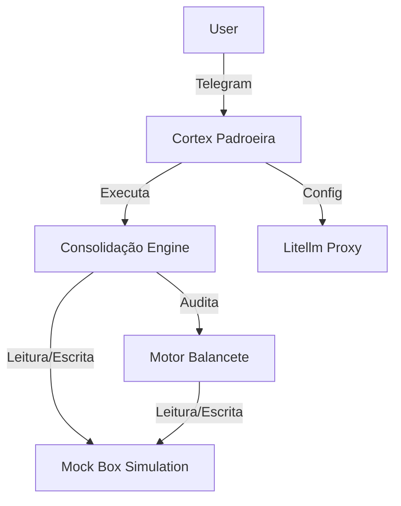

# Arquitetura

## Objetivo
Documentar a estrutura técnica e os componentes do Projeto Atlas, fornecendo uma visão clara do sistema de reconciliação fiscal e automação em operação.

## Visão Geral
O sistema é um ambiente distribuído baseado em Python, estruturado para automação de tarefas fiscais e integração com LLMs. A arquitetura utiliza um modelo de processamento assíncrono e colaboração entre múltiplos agentes, com a capacidade de interagir com sistemas de arquivos simulados (Box) e serviços de mensageria (Telegram).

## Componentes do Laboratório
- **Cortex Padroeira (cortex_padroeira.py):** Agente central responsável pela interface com o usuário via Telegram, extração de dados e orquestração inicial.
- **Engine de Consolidação (engine_consolidacao.py):** Processa expansão horizontal e espelhamento vertical de dados fiscais.
- **Motor Balancete (motor_balancete.py):** Auditoria e transposição de dados do Diário para o Balancete, aplicando regras fiscais.
- **Ambiente de Simulação (mock_box/):** Simulacro do sistema de arquivos de produção.

## Organização dos Diretórios
- `/app/`: Estrutura de código Python (modelos, schemas, banco de dados).
- `/lab_agente_web/`: Implementação lógica dos motores e agentes.
- `/mock_box/`: Dados de simulação.
- `/recursos/`: Configurações de infraestrutura (ex: Litellm).

## Arquitetura Docker
O sistema utiliza Docker para a orquestração de serviços.
- **Arquivo principal encontrado:** `/opt/stacks/litellm/compose.yaml`

## Serviços
- **Litellm:** Proxy de integração com LLMs.
- **Outros serviços:** NÃO FOI POSSÍVEL DETERMINAR.

## Fluxo dos Agentes
1. O usuário interage via Telegram.
2. O **Cortex** recebe a mensagem e dispara os motores de consolidação.
3. A **Engine** processa a consolidação baseada nos dados do mock_box.
4. O **Motor Balancete** audita os dados e atualiza o balancete.
5. O estado é persistido no ambiente de simulação.

## MCP Servers
- **Santuario Memoria:** Integrado via interface SSE (conforme configurações encontradas em `lab/instrucoes_ptojeto.txt`).

## Fluxo de Dados
Dados brutos (Planilhas Excel) -> Engine de Consolidação -> Dados processados (Planilhas Excel) -> Motor Balancete -> Resultados Finais (Planilhas Excel).

## Integrações
- **Telegram:** Via interface de bot.
- **LLM Proxy (Litellm):** Via configuração em `/opt/stacks/litellm/config.yaml`.
- **Saurus:** Via extração regex (código do Cortex).

## Diagramas Mermaid

## Limitações Conhecidas
- A persistência dos dados está confinada ao ambiente `mock_box/`.
- Dependência de variáveis de ambiente (`os.environ/DATABASE_URL`) não configuradas no repositório.

## Referências
- `PROGRESSO_V2.md`
- `/opt/stacks/litellm/config.yaml`
- `lab/instrucoes_ptojeto.txt`